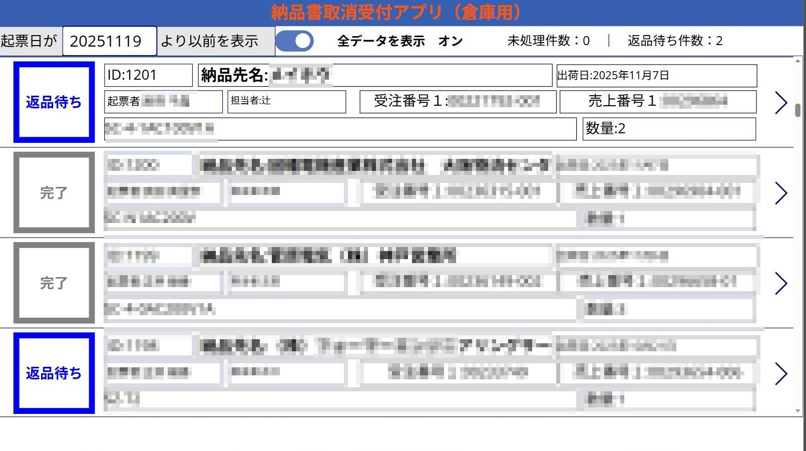
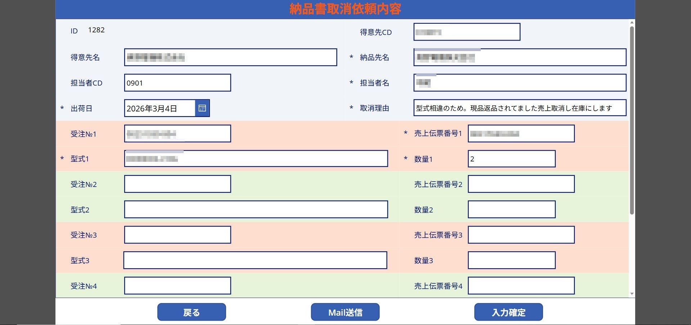
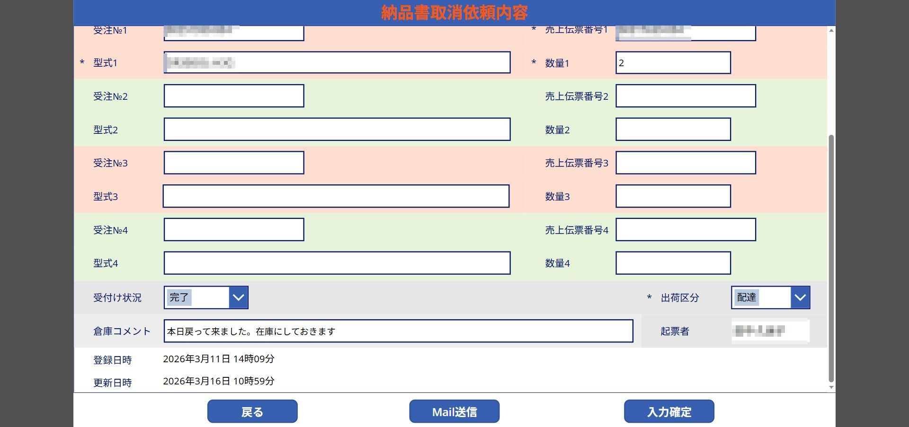

# 対応依頼管理アプリ（Power Apps サンプル）

このリポジトリは、私が実務で作成した業務改善アプリをもとに、依頼者と確認担当の間で発生する業務連絡を整理・標準化した公開用サンプルです。

実際の業務で発生していた連絡・確認・進捗共有の課題を整理し、Power Apps を用いて改善した構成を、公開用に抽象化してまとめています。

## 概要

このリポジトリは、**Power Apps を用いた業務改善アプリの構成例**として、
依頼者と確認担当の間で発生する業務連絡を整理・標準化するための
**「対応依頼管理アプリ」** の公開用サンプルをまとめたものです。

実際の業務では、依頼内容の連絡が紙・FAX・口頭・メールなどに分散しやすく、
以下のような課題が発生しやすくなります。

* 必要事項の記載漏れ
* 確認漏れや対応遅れ
* 担当者ごとの対応のばらつき
* 現在の進捗状況が見えにくい

このアプリは、そうした課題を改善するために、
**依頼用画面** と **確認用画面** の2つの役割に分けて設計したものです。

> ※ 本リポジトリは公開用サンプルです。
> 実際の業務画面・実データ・実コードは掲載していません。
> 機密情報に配慮し、画面構成・項目構成・業務フローを抽象化して記載しています。

---

## 導入前の課題（紙・FAX運用）

本アプリのような依頼業務は、導入前は紙やFAXを中心とした運用を想定しています。
このような運用では、以下のような課題が発生しやすくなります。

* 依頼連絡が届いていても、確認が遅れることがある
* 特定の担当者が気づいても、対応が保留された場合に他の担当者へ共有されにくい
* 依頼側と対応側で、進捗や完了状況の認識にズレが生じやすい
* 依頼側からは、対応状況や完了有無が見えにくい
* 紙・FAX運用のため、記入漏れや記載内容のばらつきが発生しやすい
* 対応結果の共有に、別の連絡手段（電話・メール等）が必要になりやすい

こうした課題に対して、依頼内容の入力項目を標準化し、
確認担当側でステータス管理やコメント記録を行えるようにすることで、
やり取りの見える化と確認漏れ防止を目的として構成を整理しました。

---

## 想定する構成

本アプリは、以下の2つの役割で構成されています。

* **対応依頼管理アプリ（依頼用）**
  依頼者が新規登録・修正を行う画面

* **対応依頼管理アプリ（確認用）**
  確認担当が内容確認・ステータス更新・コメント記入を行う画面

---

## 1. 対応依頼管理アプリ（依頼用）

### 主な項目

* 取引先コード
* 取引先名
* 納品先名（必須）
* 担当者名（必須）
* 対象日（必須）
* 依頼理由（必須）
* 受付番号
* 管理番号（必須）
* 商品名（必須）
* 数量（必須）
* 依頼者名（自動表示）
* 対応区分（必須）
* 備考（必須）
* ステータス（閲覧のみ）

### 主な役割

* 新規依頼の登録
* 既存依頼の修正
* 必要情報を標準化した形で確認担当へ連携

---

## 2. 対応依頼管理アプリ（確認用）

### 主な項目

* 取引先コード
* 取引先名
* 納品先名
* 担当者名
* 対象日
* 依頼理由
* 受付番号
* 管理番号
* 商品名
* 数量
* 依頼者名（閲覧のみ）
* 対応区分
* 備考
* ステータス（必須）
* 対応コメント（必須）

### 主な役割

* 登録された依頼内容の確認
* 対応状況に応じたステータス更新
* 対応コメントの記録
* 依頼者への進捗共有

---

## ステータス管理（例）

確認担当は、対応状況に応じてステータスを更新します。

### 例

* 未対応
* 確認中
* 保留
* 完了

---

## 通知機能（概要）

業務の見落とし防止や対応スピード向上のため、
登録・更新に応じた通知を行う想定です。

### 想定する動き

* 依頼者が新規登録または修正した際、確認担当へ通知
* 確認担当が対応を完了した際、必要に応じて依頼者へ結果連絡

> ※ 公開用サンプルのため、通知先アカウント構成や実装詳細は記載していません。

---

## 入力チェック・設計上の工夫

入力ミスや確認漏れを減らすため、以下のような設計を想定しています。

* 必須項目が未入力の場合は登録不可
* 自動表示項目により入力負荷を軽減
* ステータスは確認担当側のみ更新可能
* ステータス更新時は対応コメントを必須化
* 閲覧専用項目を設けて誤更新を防止

---

## 業務フロー（例）

1. 依頼者が新規依頼を登録
2. 確認担当が内容を確認
3. 状況に応じてステータスを更新
4. 必要に応じて対応コメントを記録
5. 依頼者が進捗または結果を確認

---

## 工夫したポイント

このアプリ構成では、以下の点を重視しています。

* 依頼内容の記載ルールを統一
* 必要情報の入力漏れを防止
* 確認担当側で一覧管理しやすい設計
* ステータスにより進捗を可視化
* コメントにより口頭確認やメール往復を削減
* 役割ごとに画面を分け、誤操作を防止

---

## 今後の改善案（公開用サンプルとして）

* 一覧画面での視認性向上（ステータスの見やすさ改善）
* 対応コメント欄の入力・確認のしやすさ改善
* 必須項目や入力ミスを減らすための入力チェック見直し
* 通知内容や通知タイミングの分かりやすさ改善

---

## このサンプルで伝えたいこと

本リポジトリでは、実際の業務画面やソースコードを公開する代わりに、
以下のような **業務改善の考え方** を伝えることを目的としています。

* 現場で起こりやすい課題を整理する力
* 業務フローをアプリに落とし込む力
* 役割ごとに画面や入力制御を分ける設計力
* ステータス管理や通知による進捗可視化
* 実務に即した入力チェックの考え方

---

## 想定スキル

* Power Apps による画面設計
* 業務改善アプリの要件整理
* 入力項目・閲覧項目の整理
* 役割別（依頼側 / 確認側）の画面設計
* ステータス管理の設計
* 通知機能の設計
* 実務フローの見える化

---

## 公開にあたっての注意

本リポジトリは、**実務での業務改善経験をもとに、公開用に再構成したサンプル** です。

以下の情報は掲載していません。

* 実際の業務画面
* 実際のソースコード
* 実データ
* 実在のアプリ名
* 実在の業務名称
* 実在の運用ルールや通知先情報

そのため、本リポジトリは
**実システムの再現** ではなく、
**業務改善の設計思想・構成・考え方** を示すことを目的としています。

---

## 活用イメージ

このサンプルは、以下のような場面での説明資料として活用できます。

* Power Apps を使った業務改善の実績説明
* 面接時のポートフォリオ補足資料
* 業務フロー改善の考え方の説明
* ローコードツールを使った設計例の紹介

## 画面イメージ

### 受付一覧画面

依頼状況を一覧で確認し、未処理件数や返品待ち件数を管理できます。

### 詳細入力画面（上部）

依頼内容、得意先情報、受注番号、売上伝票番号、型式、数量などを確認できます。

### 詳細入力画面（下部）

受付状況や倉庫コメントを登録し、処理状況を管理できます。

