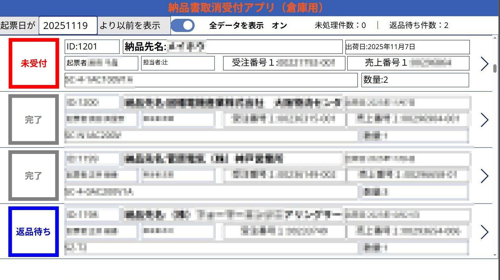
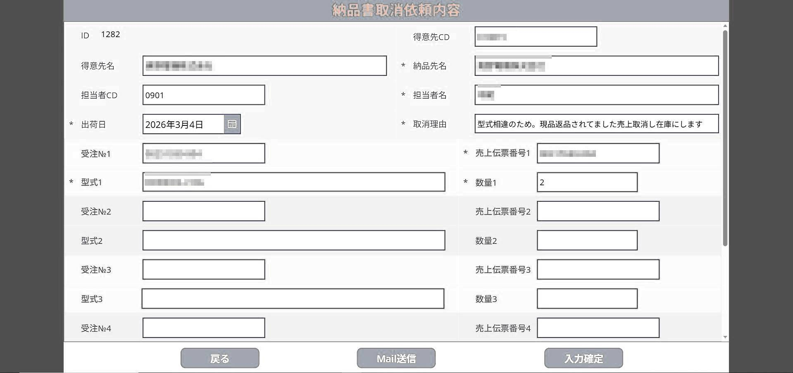
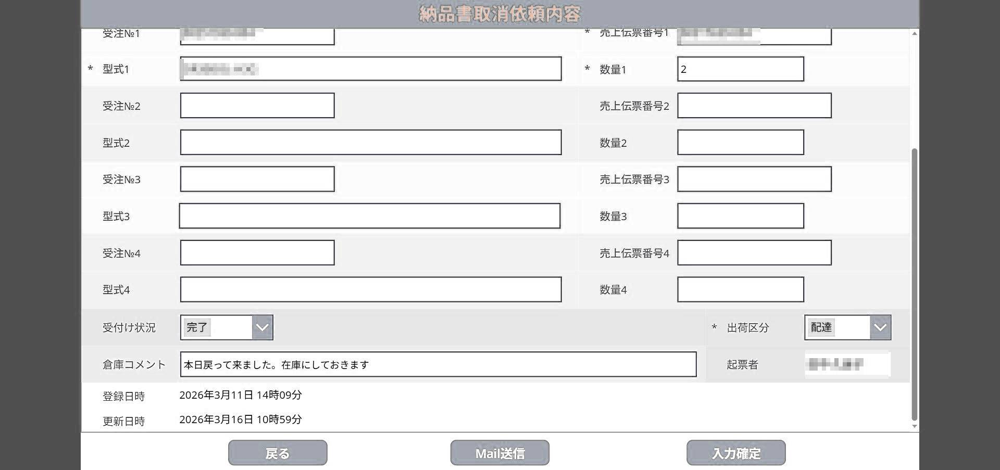

# 物流 × ITによる業務改善事例
## 本社と倉庫のキャンセル連絡を見える化し、連絡ミスを大幅削減

物流実務で培った知識・経験とITの活用スキルを生かし、紙・FAXで行っていた本社と倉庫のキャンセル連絡を、Power Appsを使ったアプリへ改善しました。

導入後は、連絡ミスがほぼゼロの状態になりました。また、本社と倉庫の認識違いによって商品が返却されない問題は、発生しなくなりました。

このページでは、私が実務で作成したアプリについて、改善の成果と設計上の工夫を紹介します。掲載内容は、機密情報に配慮して公開用に再構成しています。

### 本社と倉庫が、同じ画面で対応状況を確認

下の受付一覧画面では、依頼ごとの対応状況を確認できます。

**注目していただきたいのは、「未受付」「返品待ち」「完了」などの表示です。** 商品の返却を待っているのか、対応が終わっているのかを本社と倉庫で共有することで、双方の思い込みによる対応漏れを防ぎます。

<!-- スクリーンショット①：受付一覧画面をここに配置 -->

*従来はFAXを持っている人だけが把握していた依頼を、倉庫側の全員が確認できるようにしました。本社からも対応状況が分かります。*

## 1. 導入後の成果

今回の改善で最も重視したのは、**連絡の見落としや、本社・倉庫間の認識違いによる対応漏れを防ぐこと**です。

本社と倉庫の間で発生していた連絡ミスを大幅に削減し、導入後はほぼゼロの状態になりました。また、双方の認識違いによって必要な返品手続きが進まず、商品が返却されない問題は、導入後、発生しなくなりました。

※ 上記は実際の運用を通じて把握した状況に基づくもので、件数を集計した定量評価ではありません。

| 改善した点 | 導入後の変化 |
| --- | --- |
| 連絡の見落とし防止 | 画面とメールで連絡を確認でき、倉庫内の誰かが気づいて対応につなげられるようになりました。 |
| 担当者間の情報共有 | 一人がFAXを持つことで情報が止まる状態を解消し、倉庫側の全員が同じ依頼を確認できるようになりました。 |
| 本社・倉庫間の認識違い防止 | 「返品待ち」「完了」などの表示で現在の状況を共有し、双方の思い込みによる対応漏れを防げるようになりました。 |
| 双方向の確認 | 依頼内容の不明点や誤りを本社に指摘し、倉庫側の要望や注意事項をコメントで伝えられるようになりました。 |
| 対応結果の共有 | 倉庫で対応した際に本社の起票者へメールが届き、依頼後の状況を確認できるようになりました。 |

## 2. 対象業務と、FAX運用で起きていた課題

対象は、倉庫で商品を取りそろえた後に、顧客から本社へキャンセル依頼が入った場合の連絡業務です。

本社は倉庫へ依頼を伝え、倉庫は商品の出荷状況を確認して対応します。すでに出荷している場合には、返品に関する確認や手続きが必要になります。

従来はFAXで連絡していたため、到着に気づかない、誰かがFAXを持っていて他の担当者が確認できない、本社から倉庫の対応状況が分からない、といった問題がありました。

特に重要だったのは、**本社と倉庫が異なる認識のまま、相手が対応してくれると思い込んでしまうこと**です。

| 本社側の認識 | 倉庫側の認識 |
| --- | --- |
| 「まだ出荷前なので、キャンセルできた」 | 「昨日出荷しているので、本社が返品手続きを進めるだろう」 |

このような行き違いに気づけず、必要な手続きが進まないまま、商品が返却されないことがありました。

そこで、依頼を送った後も、**倉庫でどのように対応したか、何が未完了なのかを双方で確認できる仕組み**を設けました。

## 3. アプリによる改善の仕組み

Power Apps（業務用アプリを作成できるMicrosoftのツール）を使い、本社の依頼用画面と、倉庫の確認・対応用画面を設けました。

### 基本的な業務の流れ

1. **本社が依頼を登録する**  
   対象の商品、数量、依頼内容などを入力します。

2. **倉庫が画面とメールで依頼を確認する**  
   倉庫側の全員が同じ依頼を確認でき、特定の担当者だけに情報がとどまらないようにします。

3. **倉庫が対応状況とコメントを記録する**  
   商品の状況に応じて「返品待ち」「完了」などを表示し、必要な注意事項や要望を記載します。

4. **本社が対応結果と残っている事項を確認する**  
   倉庫対応時のメールと共有画面で状況を把握し、不明点や認識の違いがあれば双方で確認します。

### 役割に合わせた画面構成

| 画面 | 利用者 | 主な役割 |
| --- | --- | --- |
| 依頼用画面 | 本社の担当者 | 依頼の登録・修正、倉庫の対応状況とコメントの確認 |
| 確認・対応用画面 | 倉庫の担当者 | 依頼内容の確認、対応状況の更新、コメントの記録 |

依頼する側と対応する側の役割を分けながら、同じ依頼について情報を共有できる構成にしています。

## 4. 私が担ったことと、物流・ITの経験を生かした工夫

私は、物流実務で把握した連絡上の課題をもとに、必要な情報と確認の流れを整理し、Power Appsによるアプリの設計・作成を行いました。

物流経験を生かしたのは、**出荷状況によって必要な対応が変わることや、部門間で認識の違いが起きる場面を捉えた点**です。その理解をもとに、ITでどのように情報を共有するかを設計しました。

| 物流実務から捉えた課題 | アプリの設計に反映したこと |
| --- | --- |
| 商品を取りそろえた段階と、出荷済みの段階では、必要な対応が異なる | 「返品待ち」「完了」など、対応状況を区別して共有できるようにしました。 |
| 一人が依頼を把握しているだけでは、倉庫内で情報が行き渡らない | 個人が持つ紙に頼らず、倉庫側の全員が同じ依頼を確認できるようにしました。 |
| 依頼を送った側は、相手が対応してくれたと思い込みやすい | 本社でも倉庫の対応状況を確認でき、対応時には起票者へメールが届くようにしました。 |
| 出荷状況や依頼内容によって、定型的な表示だけでは伝えきれない事情がある | コメント欄を設け、倉庫側の要望・注意事項・確認が必要な点を伝えられるようにしました。 |

設計で重視したのは、依頼した人と対応する人が、同じ状況を理解して業務を進められることです。

現場で起こる行き違いを具体的に把握し、画面・通知・対応状況の表示・コメント共有を組み合わせて、対応漏れを防ぐ仕組みに落とし込みました。

## 5. 詳細画面で見る、確認と情報共有の工夫

冒頭の一覧画面で依頼全体の状況を把握し、詳細画面で個々の依頼内容と対応内容を確認する構成です。

### 詳細入力画面（上部）：対象の商品と依頼内容を確認する

取引先情報、受注番号、売上伝票番号、型式、数量など、どの商品に対する依頼なのかを確認するための情報をまとめています。

**依頼の対象を特定するための情報が、同じ画面にそろっている点**に注目してください。

<!-- スクリーンショット②：詳細入力画面（上部）をここに配置 -->

*本社と倉庫が同じ依頼内容を参照し、不明点や誤りがあれば確認につなげられます。*

### 詳細入力画面（下部）：対応状況と倉庫側の事情を共有する

受付状況と倉庫コメントを記録する画面です。

**現在の状況に加えて、倉庫側から本社へ伝えたい内容を残せる点**が、FAXによる一方向の連絡から改善したポイントです。

<!-- スクリーンショット③：詳細入力画面（下部）をここに配置 -->

*状態の表示だけでは伝わりにくい事情や要望、注意事項をコメントで補い、本社と倉庫の認識をそろえます。*

## 6. この経験を次の職場でどう生かせるか

この改善では、物流現場の経験をもとに、連絡ミスが起きる原因を整理し、ITを使って日々の業務で確認できる仕組みに落とし込みました。

次の職場でも、以下のような形で貢献したいと考えています。

- **現場の課題を整理する**  
  紙や口頭で行われている業務から、情報が止まる箇所や、認識違いが起きやすい箇所を見つけます。

- **業務に合った改善方法を考える**  
  実際の作業手順や担当者の役割を踏まえ、必要な情報と確認方法を整理します。

- **物流とITの橋渡しをする**  
  現場の困りごとをアプリの機能に落とし込み、ITに詳しくない方にも目的や使い方が伝わる形で説明します。

物流の知識と経験を、連絡ミスの防止や部門間の情報共有といった具体的な業務改善につなげられることが、私の強みです。

## 7. 公開内容について

本リポジトリは、実務での業務改善経験をもとに、成果と設計の考え方を説明するために再構成した公開用資料です。

会社・取引先・個人を特定する情報、実データ、実際のソースコード、通知先や社内運用の詳細は掲載していません。画面名や項目などは、公開用の表現を使用しています。

実行可能なアプリの配布ではなく、業務改善の実績を紹介するポートフォリオとして公開しています。
